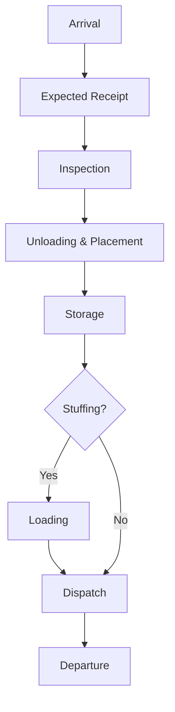

# 📦 Project 1: CTMS — Container Terminal Analytics

[](https://office.com)
[](https://powerbi.microsoft.com)
[](https://python.org)

> **Domain:** Logistics / Container Terminal Management  
> **Role:** Business Analyst / Process Analyst  
> **Tools:** Excel · Power BI · 1C:Enterprise 8.3 · Business Process Modeling  
> **Year:** 2024

---

## 🎯 Project Goal / Цель проекта

**[EN]** Analyze and document operational processes for the Container Terminal Management System (CTMS) to support system implementation, identify gaps, and improve container tracking accuracy.

**[RU]** Проанализировать и задокументировать операционные процессы системы управления контейнерным терминалом (CTMS) для поддержки внедрения системы, выявления пробелов и повышения точности отслеживания контейнеров.

---

## 🏗️ Context / Контекст

The terminal operates in **Atyrau, Kazakhstan** and handles:
- Railway container flows (ocean + feeder routes)
- 3 terminal types: Port · Rear terminal · Industrial terminal
- Container types: TEU (20ft) and FEU (40ft)
- Integration between: Railway system ↔ CTMS ↔ WMS ↔ Loading equipment

---

## 🔄 Container Lifecycle Mapping / Схема жизненного цикла контейнера



See the [Detailed Process Map](./process-map.md) for step-by-step operations.

---

## 🗺️ Terminal Structure Analysis / Анализ структуры терминала

### Zones / Зоны
| Zone | Purpose |
|------|---------|
| Reception Front | Train unloading area |
| Inspection Zone | Damage check before/after unloading |
| Storage Zone | Main container yard |
| Defect & Repair Zone | Damaged containers |

### Operations Documented / Задокументированные операции
| Operation | Key Steps | Integrations |
|-----------|-----------|--------------|
| **Arrival** | Application → Train dispatch → Unload | Railway + Loaders |
| **Inspection** | External + Internal assessment | CTMS module |
| **Placement** | Cell assignment via topology | CTMS → WMS |
| **Stuffing** | Assembly → Container feed → Loading | WMS + Loaders |
| **Dispatch** | Order → Platform → Load → Handoff | Railway + Loaders |
| **Repair** | Damage log → Repair tracking | CTMS module |

---

## 📊 Data Analysis Performed / Проведённый анализ данных

### Container Flow Analysis
- Tracked **154+ container movements** across train arrivals (June–August 2024)
- Analyzed status transitions: New → In Progress → Completed
- Identified trains with high defect rates for prioritized inspection

### Key Fields Analyzed / Ключевые поля анализа
```
Per Container Record:
  - Container ID (e.g., TXGU7149294)
  - Container Type (ISO code: 42G1, 45G1, 4210, 4510)
  - Weight / Capacity (kg)
  - Loaded status (Yes/No)
  - Storage cell assigned
  - Train number
  - Arrival/Completion dates
  - Damage type (if applicable)
```

### CTMS Modules Analyzed
| Module | Code | Function |
|--------|------|---------|
| Expected Arrivals | 01_01 | Pre-arrival planning |
| Container Applications | 01_02 | Individual container records |
| Container Receipts | 01_03 | Confirmed arrivals |
| Container Inspections | 01_04 | Damage tracking |
| Container Movements | 03_01 | Internal relocations |
| Container Stuffing | 03_02 | Loading operations |

---

## 🔍 Findings & Recommendations / Выводы и рекомендации

See the [Business Requirements & Gaps](./business-requirements.md) document for a deep dive into identified inefficiencies.

---

## 🐍 Live Data Analysis / Живой анализ данных

We have implemented a Python script to analyze container flows from raw data.

**Run the analysis:**
```bash
python3 analyze_flows.py
```

## 📈 Power BI Dashboard Concept / Концепция дашборда

```
┌─────────────────────────────────────────────────────┐
│              CTMS Operations Dashboard               │
├──────────────┬──────────────┬────────────────────────┤
│ Total TEU    │ Arrival Today│ Pending Inspection     │
│ on Terminal  │    24        │        8               │
│    312       │              │                        │
├──────────────┴──────────────┴────────────────────────┤
│  Container Status Flow (Funnel)                      │
│  New → In Progress → Placed → Dispatched            │
├─────────────────────────────────────────────────────┤
│  Daily Throughput (Line Chart: 30-day trend)        │
├─────────────────────────────────────────────────────┤
│  Damage Types (Bar Chart)   │ Zone Utilization (%)  │
└─────────────────────────────────────────────────────┘
```

---

## 📂 Files in This Folder / Файлы в папке

| File | Description |
|------|-------------|
| `README.md` | This file — project overview |
| `process-map.md` | Detailed container lifecycle |
| `business-requirements.md` | Requirements & system gaps |

---

*← [Back to Portfolio](../README.md)*
