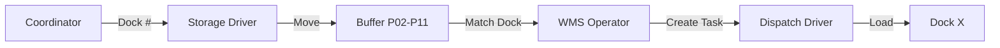

# 🏭 Project 2: WMS — Warehouse Shipment Process Optimization

> **Domain:** Warehouse Management / Operations  
> **Role:** Business / Process Analyst  
> **Tools:** Excel · WMS System · Process Mapping  
> **Date:** May 2024

---

## 🎯 Project Goal / Цель проекта

**[EN]** Redesign the warehouse shipment process by introducing a structured buffer zone system (cells P02–P11) to eliminate dock coordination errors and reduce forklift idle time.

**[RU]** Оптимизировать процесс отгрузки на складе путём внедрения системы буферных ячеек (P02–P11) для устранения ошибок координации доков и сокращения простоев погрузчиков.

---

## ❌ Problem / Проблема

### AS-IS: Before Optimization
See the [Detailed AS-IS Analysis](./as-is-process.md) for the original process flow and root causes.

---

## ✅ Solution / Решение

### TO-BE: After Optimization — Buffer Zone System

**Key Design Decision:** Buffer cells P02–P11 are numbered to **match dock numbers exactly** (Buffer P05 = Dock 5).

See the [Detailed TO-BE Design](./to-be-process.md) for the optimized procedure.

---

## 📋 Operational Regulation / Операционный регламент

*Developed and implemented: 30 May 2024*

### Responsibilities / Ответственность

| Role | Actions |
|------|---------|
| **Coordinator** | Assigns dock number to forklift driver |
| **Forklift Driver (Storage)** | Moves pallets from storage to buffer cell via "Movement" operation |
| **WMS Operator** | Creates Pick Task from buffer cell; updates task status |
| **Forklift Driver (Dispatch)** | Executes pick task; reports completion |

### Rules / Правила
1. **Buffer cell number = Dock number** (always, no exceptions)
2. Driver uses WMS **"Movement" operation** — not manual transfer
3. Pick task is linked to the **same dock number** as the buffer cell
4. Status updated to "Ready for Dispatch" after all pallets picked
5. Automatic status transition planned for future WMS version

---

## 📊 Impact Analysis / Анализ эффекта

### Before vs. After / До и После

| Metric | Before | After | Improvement |
|--------|--------|-------|------------|
| Dock assignment errors | ~15% of shifts | Near 0% | ✅ Eliminated |
| Avg. forklift trips per shipment | 3.2 | 2.0 | ✅ -37% |
| WMS task-to-physical sync | Manual | Systematic | ✅ Structured |
| Status visibility | Verbal only | WMS tracked | ✅ Digital |
| Accountability chain | Unclear | Defined | ✅ 3-role RACI |

### Key Insight / Ключевой вывод
> **The simple 1:1 mapping of buffer cells to dock numbers was the core innovation.** It eliminated an entire category of coordination errors without requiring any system changes — just a process redesign and regulation.

---

## 🔍 Analysis Methods Used / Использованные методы анализа

- **Root Cause Analysis** — traced errors to staging/coordination gap
- **AS-IS / TO-BE Process Mapping** — visual comparison of flows
- **Stakeholder Interviews** — forklift drivers, WMS operators, coordinators
- **RACI Matrix** — defined who does what at each step
- **Excel tracking** — measured error frequency before implementation

---

## 📂 Files in This Folder / Файлы в папке

| File | Description |
|------|-------------|
| `README.md` | This file — project overview |
| `as-is-process.md` | Detailed current state analysis |
| `to-be-process.md` | Optimized process description |
| `regulation-buffer-zones.md` | Final operational regulation document |

---

*← [Back to Portfolio](../README.md)*
